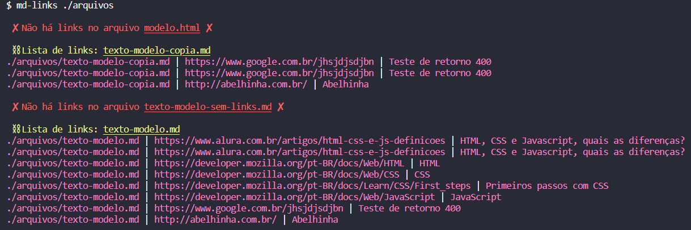
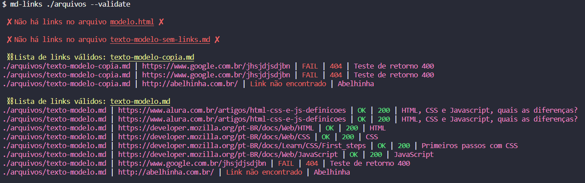
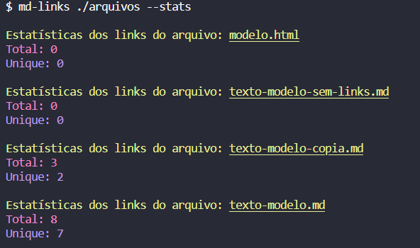
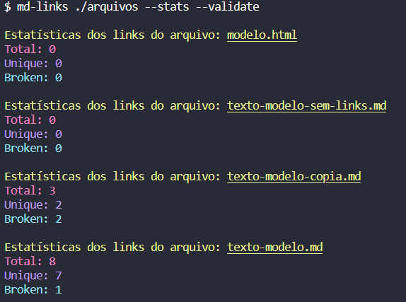
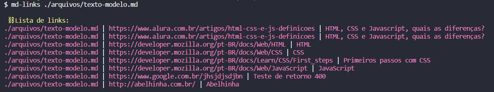
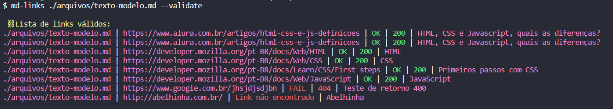
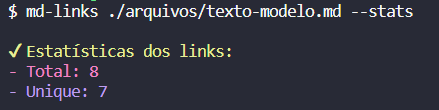
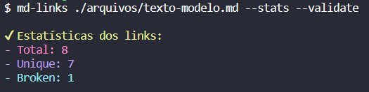
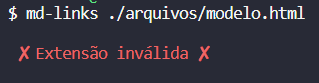
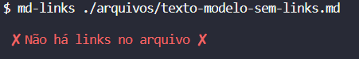

# 🔗 Markdown Links

## Índice 📌

* [1. Resumo do projeto 📃](#1-resumo-do-projeto) 
* [2. Funcionalidades 💻](#2-funcionalidades) 
* [3. Instalação ⚙️](#3-instalação)
* [4. Guia de uso - comandos 🗺️](#4-guia-de-uso)
* [5. Ferramentas utilizadas 🔧](#5-ferramentas-utilizadas)

## 1. Resumo do projeto 📃

Nesse projeto foi desenvolvida uma biblioteca que lê e analisa arquivos no formato Markdown, para verificar os arquivos que contenham links e mostrar algumas estatísticas.

Markdown é uma linguagem de marcação muito popular entre os programadores. É usada em muitas plataformas que manipulam texto (GitHub, fórum, blogs e etc) e é muito comum encontrar arquivos com este formato em qualquer repositório (começando pelo tradicional README.md). Os arquivos Markdown normalmente contém links que podem estar quebrados, ou que já não são válidos, prejudicando muito o valor da informação que está ali.

## 2. Funcionalidades 💻

As funcionalidades atualmente disponíveis são:

`Listagem de links`: exibe os links encontrados nos arquivos Markdown, mostrando a rota do arquivo, a URL encontrada e o texto descritivo do link.

`Validação de links`: verifica se os links encontrados nos arquivos Markdown estão funcionando corretamente, retornando o código de status HTTP da URL correspondente. Também são exibidas mensagens sobre a validação, `fail` em caso de falha ou `OK` em caso de sucesso.

`Estatísticas de links`: exibe o número total de links encontrados no arquivo, o total de links únicos e o total de links que não estão funcionando corretamente/quebrados.

Essas funcionalidades se aplicam tanto para um arquivo específico quanto para um diretório. 

## 3. Instalação ⚙️

Para instalar a biblioteca, execute o seguinte comando no terminal:

```bash
  npm i paulajanu-sap009-md-links
```
    
## 4. Guia de uso - comandos 🗺️

**🔍 Listagem de links do diretório:**

```bash
  md-links ./nomeDoDiretório
```
Esse comando procura arquivos na rota especificada e imprime os links encontrados, juntamente com a rota do arquivo em que cada link foi encontrado e o texto descritivo do link. Caso algum arquivo não seja Markdown `(.md)` ou não apresente links, uma mensagem vai ser mostrada na tela. A informação retorna da seguinte maneira ao usuário:
<br><br>

**🔍 Validação de links do diretório**

```bash
  md-links ./nomeDoDiretório --validate
```
Esse comando com a opção `--validate` fará uma requisição HTTP para verificar se cada link funciona ou não. Cada link possui seu status HTTP e/ou mensagem correspondente:

`OK` = Link válido
`FAIL` = Link inválido
`Link não encontrado` = Link não encontrado 

A informação retorna da seguinte maneira ao usuário:
<br><br>

**🔍 Estatísticas de links do diretório**

```bash
  md-links ./nomeDoDiretório --stats
```
Esse comando com a opção `--stats` exibe o número total de links encontrados no arquivo e o total de links únicos. A informação retorna da seguinte maneira ao usuário:
<br><br>

Comando com a opção `--stats --validate` exibe o número total de links encontrados no arquivo, o total de links únicos e o total de links que não estão funcionoando corretamente/quebrados.
```bash
  md-links ./nomeDoDiretório --stats --validate
```
A informação retorna da seguinte maneira ao usuário:
<br><br>

**🔍 Listagem de links do arquivo:**

```bash
  md-links ./nomeDoDiretório/caminhoDoArquivo
```
Esse comando lê o arquivo Markdown especificado e imprime o caminho do arquivo, os links encontrados e o texto descritivo do link. A informação retorna da seguinte maneira ao usuário:
<br><br>

**🔍 Validação de links do arquivo**

```bash
  md-links ./nomeDoDiretório/caminhoDoArquivo --validate
```
Esse comando com a opção `--validate` lê o arquivo Markdown especificado e assim como ocorre no diretório, fará uma requisição HTTP para verificar se cada link funciona ou não. A informação retorna da seguinte maneira ao usuário:
<br><br>

**🔍 Estatísticas de links do arquivo**

```bash
  md-links ./nomeDoDiretório/caminhoDoArquivo --stats
```
Esse comando com a opção `--stats` lê o arquivo Markdown especificado e assim como ocorre no diretório, exibe o número total de links encontrados no arquivo e o total de links únicos. A informação retorna da seguinte maneira ao usuário:
<br><br>

Esse comando com a opção `--stats --validate` lê o arquivo Markdown especificado e assim como ocorre no diretório, exibe o número total de links encontrados no arquivo, o total de links únicos e o total de links que não estão funcionoando corretamente/quebrados.

```bash
  md-links ./nomeDoDiretório/caminhoDoArquivo --stats --validate
```
A informação retorna da seguinte maneira ao usuário:
<br><br>

**❌ Mensagens de erros que podem aparecer**

Arquivo com extensão que não seja Markdown `(.md)`:
<br><br>

Arquivo sem links:
<br><br>

## 5. Ferramentas utilizadas 🔧

<div align="center">
 
 
   
</div>